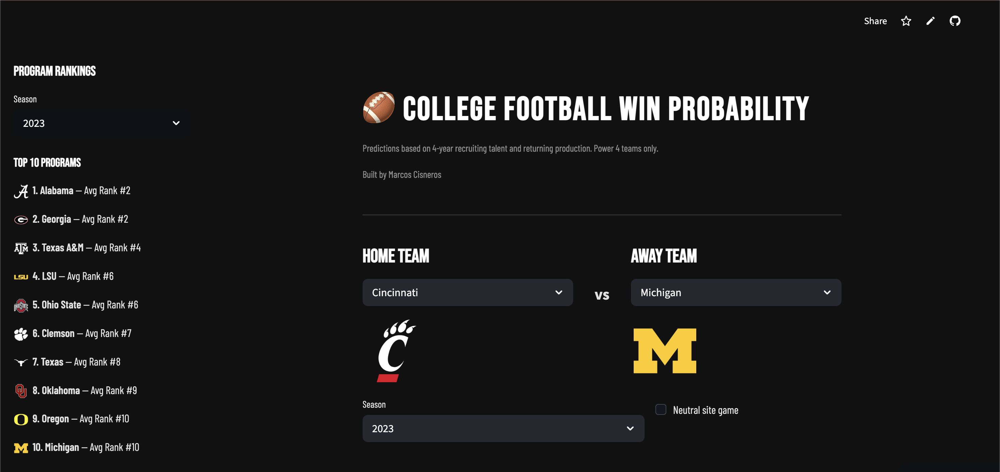

# College Football Recruiting vs. Wins — Predictive Model

**Live App:** [Recruiting Class Analyzer](https://recruiting-class-analyzer-lkeemy72oemz9iusy36uax.streamlit.app/?home=Cincinnati&away=Michigan&year=2023)

This project tests whether college football recruiting rankings can predict game outcomes. Built using the CFBD API across 14 seasons and 255 FBS programs, it compares a recruiting-based model against Vegas point spreads as a real-world benchmark.



---

## Milestone 1 — Data Pipeline

**Files:** `data_pull.py`, `wins_and_merge.py`

The first step was building a clean dataset. Recruiting class rankings were pulled from the CFBD API for every FBS team from 2010–2023, capturing each team's national recruiting rank and composite recruiting points for that class. Win/loss records were then pulled for every team and year in that dataset and merged into a single file.

**Output:** `merged_data.csv` — 2,765 rows covering 255 teams across 14 seasons, with recruiting rank, recruiting points, wins, and losses per team-year.

---

## Milestone 2 — Season-Level Win % Model

**File:** `model.py`

The first model asked a simple question: does a team's recruiting class predict how many games they win that season?

The short answer is: barely — but context matters enormously.

**Finding 1 — Mixing all FBS teams together kills the signal.**
When every FBS team is included, recruiting rank explains only 3% of the variance in win percentage (R² = 0.03). The reason is that a team ranked 80th nationally in recruiting might go 9-3 in the MAC or 4-8 in the SEC. The model can't resolve that without knowing the competition level.

**Finding 2 — Filtering to Power 4 teams reveals real signal.**
Once the dataset is limited to SEC, Big Ten, Big 12, and ACC teams — where recruiting rankings are more comparable — R² jumps to 0.18. Recruiting explains roughly 1 in 5 wins for Power 4 programs.

**Finding 3 — Lagged recruiting matters, but less than expected.**
Adding the prior 3 years of recruiting data (representing underclassmen through seniors on the roster) improved the model slightly, but same-year recruiting rank remained the strongest individual predictor. This is likely because recruiting rank acts as a proxy for overall program prestige rather than the freshmen actually playing.

**Key takeaway:** Recruiting is a necessary but not sufficient condition for winning. Programs that recruit poorly almost never win at a high level, but programs that recruit well don't automatically win — that's where coaching and player development separate teams.

---

## Milestone 3 — Game-Level Talent Differential Model

**File:** `game_model.py` (v1 — recruiting only)

The season-level model was still noisy because schedules differ across teams. The game-level model removed that problem entirely by comparing the two teams in each individual matchup head-to-head.

For every Power 4 vs. Power 4 regular season game from 2014–2023, the model calculated each team's 4-year rolling average recruiting rank — an approximation of current roster talent — and used the differential between them to predict the winner.

**Finding 1 — Head-to-head recruiting differential is a meaningful predictor.**
The model achieved 62.7% accuracy and an AUC-ROC of 0.69. For reference, a coin flip is 0.50 and Vegas sportsbooks with all available information operate around 0.70–0.72. Getting to 0.69 with a single signal is significant.

**Finding 2 — The relationship is linear.**
Logistic Regression outperformed Random Forest, meaning a bigger recruiting talent gap proportionally increases win probability. There are no complex interactions to find — more talent is more talent.

**Finding 3 — Home field advantage is real but modest.**
The base home win rate across the dataset is ~55%, consistent with known home field advantage in college football.

---

## Milestone 4 — Adding Returning Production

**File:** `game_model.py` (v2 — recruiting + returning production)

The upgraded model added returning production data for each team: specifically `percent_ppa`, which measures the percentage of last season's Predicted Points Added (a per-play value metric) that is returning for the current season. This captures how experienced a team's roster is going into each game.

**Finding 1 — Returning production is more predictive than recruiting rank.**
The feature coefficient for returning production differential was 1.23, compared to near-zero for recruiting rank and points differential. When both variables compete, experience dominates potential. The team running back their key contributors tends to outperform the team that signed the flashier class but has a young roster.

**Finding 2 — Adding returning production improved the model.**
AUC improved from 0.69 to 0.70 and accuracy improved from 62.7% to 64.2%. Gaining 1.4 points of AUC from one additional variable is a meaningful improvement — it represents the model correctly ranking roughly 12 more games out of 877.

**Finding 3 — This explains real patterns in college football.**
Programs like Iowa and Wisconsin consistently overperform their recruiting rankings because they develop and retain players. Blue-blood programs that lose significant production to the NFL Draft or transfer portal in a given year often underperform their recruiting prestige. The data backs this up.

**Key takeaway:** Recruiting rank measures potential. Returning production measures experience. In college football, experience wins.

---

## Milestone 5 — Vegas Benchmark

**File:** `betting_lines.py`

The final test: how does the model hold up against Vegas point spreads? Vegas lines were pulled from the CFBD BettingApi for every Power 4 game from 2014–2023, using the consensus line (market average across all providers) where available.

**Finding 1 — Vegas is meaningfully better overall.**
On the 2021–2023 test set, Vegas correctly predicted the winner 71% of the time compared to the model's 64%. That 7-point gap represents the combined value of everything Vegas knows that the model doesn't — injuries, coaching tendencies, sharp money movement, and years of market refinement.

**Finding 2 — When they disagree, trust Vegas.**
The model and Vegas disagreed on 243 of 877 test games. On those disagreements, the model was right only 37.5% of the time — worse than a coin flip. Vegas was right 62.5% of the time on the same games. Betting against Vegas whenever the model disagreed would have been a losing strategy by a wide margin.

**Finding 3 — Recruiting and returning production are not market-inefficient signals.**
The model's variables are real and meaningful, but Vegas has already priced them in. The disagreements are not cases where the model found something Vegas missed — they are cases where Vegas had information the model didn't. To beat Vegas, you would need variables that are underweighted by the market, such as late injury reports, pre-game line movement, or coaching matchup tendencies.

**Key takeaway:** This model is a strong analytical tool for understanding what drives college football outcomes, but it is not a betting edge. The gap between 64% and 71% accuracy is the price of not knowing what Vegas knows.

---

## Summary of Results

| Model | Features | Metric | Score |
|---|---|---|---|
| Season Win % — All FBS | Recruiting rank + lags | R² | 0.03 |
| Season Win % — Power 4 | Recruiting rank + lags | R² | 0.18 |
| Game Outcome — Recruiting only | 4yr avg rank differential | AUC-ROC | 0.69 |
| Game Outcome — Full model | Recruiting + returning production | AUC-ROC | 0.70 |
| Vegas Benchmark — Model accuracy | 2021–2023 test set | Accuracy | 64.1% |
| Vegas Benchmark — Vegas accuracy | 2021–2023 test set | Accuracy | 71.0% |
| Model on disagreements | Games where model ≠ Vegas | Accuracy | 37.5% |

---

## How to Run

1. Clone the repo and navigate into the project directory
2. Create a virtual environment and install dependencies:
   ```
   python -m venv venv
   source venv/bin/activate  # Mac/Linux
   venv\Scripts\activate     # Windows
   pip install -r requirements.txt
   ```
3. Add your CFBD API key to a `.env` file:
   ```
   CFBD_API_KEY=your_key
   ```
4. Run scripts in order:
   ```
   python data_pull.py       # pulls recruiting class rankings → recruiting_classes.csv
   python wins_and_merge.py  # pulls win/loss records and merges → merged_data.csv
   python model.py           # season-level win % model
   python game_model.py      # game-level talent differential model
   python betting_lines.py   # Vegas benchmark and disagreement analysis
   ```

---

## Tools & Assistance

Built with Python using the `cfbd`, `pandas`, `scikit-learn`, and `matplotlib` libraries. Data sourced from the [College Football Data API](https://collegefootballdata.com).

This project was built with assistance from Claude (Anthropic) via Claude Code for debugging, API integration, and code structure. Project direction, analytical framing, and interpretation of findings were the author's own.
